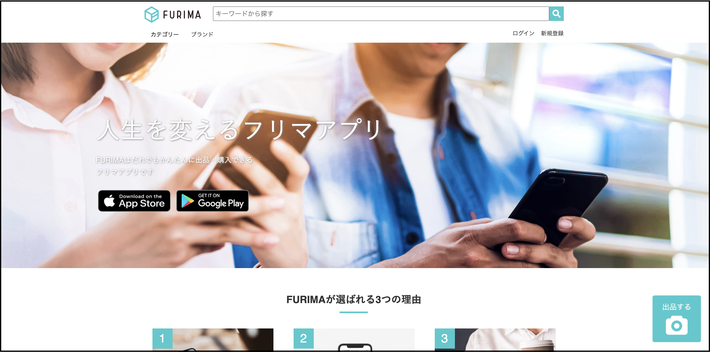

# アプリ概要    
## フリーマーケットアプリ    
    
### 詳細説明  
チーム（アイジャル開発）でフリマーケットアプリを作成しました。  
・URL http://18.181.155.100/  
・ID: admin  
・Pass: 2222  
### テスト用アカウント  
■購入者用  
・メールアドレス: buyer_user@gmail.com  
・パスワード: buyer_user  
■購入用カード情報  
・番号： 4242424242424242  
・期限： Sun Dec 20 2020 00:00:00 GMT+0900 (日本標準時)  
・セキュリティコード：123  
■出品者用  
・メールアドレス名: seller_user1@gmail.com  
・パスワード: seller_user  
■開発状況  
◯開発環境  
・Ruby/Ruby on Rails/MySQL/Github/AWS/Visual Studio Code  
■開発期間と平均作業時間  
・開発期間：5/16~7/29  
・1日あたりの平均作業時間：3  
■開発体制  
・人数：4  
。アジャイル型開発（スクラム）  
・Trelloによるタスク管理  

■動作確認方法  
・Chromeの最新版を利用してアクセスしてください。  
・ただしデプロイ等で接続できないタイミングもございます。その際は少し時間をおいてから接続ください。  
・接続先およびログイン情報については、上記の通りです。  
・同時に複数の方がログインしている場合に、ログインできない可能性がございます。  
・テストアカウントでログイン→トップページから出品ボタン押下→商品情報入力→商品出品  
・確認後、ログアウト処理をお願いします。 
開発担当箇所
担当箇所一覧と確認方法  
■ログイン、新規登録（フロントエンド、バックエンド）  
　◯出品用アカウントで、ログイン、新規登録する事ができご覧いただけます。  
　　・http://18.181.155.100/にアクセスするとご覧いただけます。  

■商品詳細ページ（フロント、バックエンド）  
　◯トップページの新規投稿商品をタップするとご覧いただけます。  
　　・http://18.181.155.100/にアクセスするとご覧いただけます。  

各担当箇所の詳細  
■ログイン、新規登録  
　◎概要  
　　◯新規ユーザー登録  
　　◯ログイン、ログアウト機能  
　　◯DBへの登録  
　◎担当内容  
　　◯ウィザード形式での登録  
　　◯各項目のバリテーション（必須項目を入力しないと登録できない電話番号、郵便番号はハイフン付きの半角数    
    　　　字のみ、フリガナはカナ入力のみなど）  
　　

■商品詳細表示  
　◎概要  
　　◯商品の各項目、写真をを表示  
  　◎担当内容  
　　◯登録されたDB、アイテム、カテゴリーテーブルかインスタンスを使用して表示  
　　◯モデルにenumを作成しDBのidと連携させ表示  
　　◯if文を使用し出品者にしか商品の情報編集・削除のリンクが踏めないように実装、また出品者以外にしか商品    
     　　　購入のリンクが踏めないように実装  

■開発を通じて得られた知見  
工夫した点  
①チームとして工夫を行った点  
　毎週のミーティングでそれぞれが自分で決めた次週までの目標、その達成度を発表しあい、チームとして約束事を  
  　作成しました。  
　また４人全員で毎日集まるのは難しかったため、コアタイムの合う２人同士をペアとして、助け合い、協力しなが        
  　ら制作を行いました。  

②個人として工夫を行った点  
　ランチミーティングを提案し実行しました。  
　週に１回のミーティングでは、全体のコミュニケーション不足を感じたため、全員が少しでも集まりやすいランチ    
  　タイムを使い、少しの時間でもコミュニケーションを取る事を意識しました。  

苦労した点  
①チームとして苦労した点  
　コミュニケーション不足、最初の時点でのタスクの洗い出しの２点です。  
　最初はコミュニケーションの不足から、開発の段取り、チームの進捗、お互いに困っている事がわからず進んで  
  　しまい、開発に遅れが生じ、上手くいかない事が度々起きました。  
　ミーティングの時間を増やし、その中で雑談をする機会を多くする、ランチミーティングを行いコミュニケーショ  
 　ンの場を増やす事で改善され、チーム開発でのコミュニケーションの大切さを体験しました。  
　またタスクの洗い出しですが、目標や機能の繋がりを考えず、実装したいタスクを選びそれぞれ実装してしまった  
 　ため、他タスクが実装されてからしか、実装できない事が起きてしまったなど、効率よく実装できませんでした。  
  　最初の段取り、アウトラインを作り込む事の大切さを学びました。  

②個人として苦労した点  
　ログイン、新規登録機能の実装で苦労しました。  
　ウィザード形式で、登録項目を増やしてカスタマイズした事は初めてで、バリテーション、テスト、enum、  
  　divise、コントローラー、モデル設定など実装に必要な工程が多く全てに繋がりがあり、何度もやり直しをしました。  
　わからないなりにもまずは、最初に全体像を掴みタスクを洗い出してやれば、効率的に実装できたと思います。  
  　まずは段取りが大切だと経験しました。  

## usersテーブル
|Column|Type|Options|
|------|----|-------|
|nickname|string|null: false|
|last_name|string|null: false|
|first_name|string|null: false|
|last_name_kana|string|null: false|
|first_name_kana|string|null: false|
|birthday|date|null: false|
|email|string|null: false, unique: true|
|encrypted_password|string|null: false|
|telnum|integer |null: false|
|gender|integer |null: false|
|year|integer|null: :false|
|month|integer|null: :false|
|day|integer|null: :false|
### Association
has_one :address 
has_one :card 
has_many :items 

## itemsテーブル
|Column|Type|Options|
|------|----|-------|
|name|string|null: false|
|detail|text|null: false|
|price|integer|null: false|
|category_id|reference|null: false, foreign_key: true|
|brand|string||
|condition_id|integer|null: false|
|shipping_cost_id|integer|null: false|
|shipping_days_id|integer|null: false|
|shipping_area_id|integer|null: false|
|user_id|integer|null: false, foreign_key: true|
|costomer|integer||
### Association
belongs_to :user 
belongs_to :category 
has_many :item_images 

## addressesテーブル
|Column|Type|Options|
|------|----|-------|
|postal_code|string|null: false|
|prefecture_id|integer|null: false|
|city|string|null: false|
|street|string|null: false|
|building|string||
|phone|string||
|user_id|reference|null: false, foreign_key: true|
### Association
belongs_to :user 

## cardテーブル
|Column|Type|Options|
|------|----|-------|
|user_id|integer|null: false, foreign_key: true|
|customer_id|string|null: false|
|card_id|string|null: false|
### Association
belongs_to :user 

## categoriesテーブル
|Column|Type|Options|
|------|----|-------|
|name|string|null: false|
|ancestry|string||
### Association
has_many :items 

## item_imagesテーブル
|Column|Type|Options|
|------|----|-------|
|image|string|null: false|
|item_id|references|null: false, foreign_key: true|
### Association
belongs_to :item

